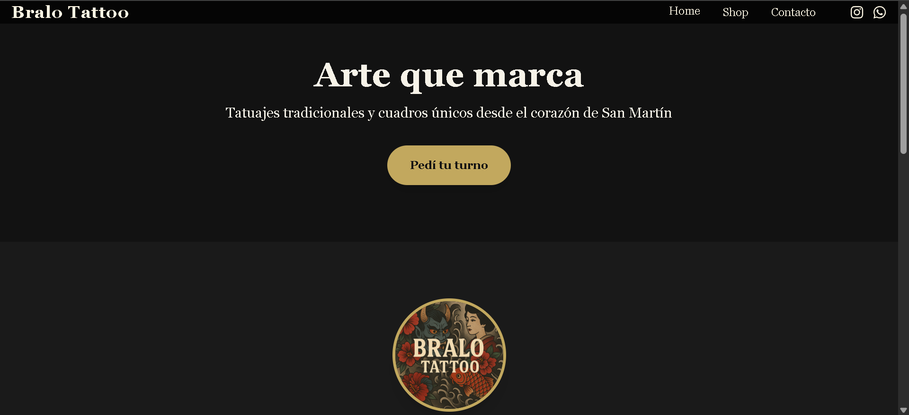

# 💻 Portfolio Web - Axel Adrian El Hilon

Este es mi portfolio personal como diseñador UI/UX y desarrollador frontend. Lo desarrollé con **React.js** para mostrar mis proyectos, habilidades, contacto y un poco sobre quién soy. ✨

## 🛠️ Tecnologías utilizadas

- **React.js** (con Vite)
- **HTML5 / CSS3**
- **JavaScript (ES6+)**
- **React Router DOM**
- **TailwindCSS** 
- **Figma** (para el diseño UI)

## 🌐 Secciones principales

- **Inicio** – Presentación personal y CTA.
- **Proyectos** – Galería de trabajos con detalles.
- **Sobre mí** – Información sobre mi experiencia, herramientas y enfoque.
- **Contacto** – Redes sociales y formulario de contacto.

## 🖼️ Captura del proyecto

 <!-- Cambiar por la imagen principal de tu portfolio -->

## 🚀 Cómo ejecutarlo localmente

```bash
# Clonar el repositorio
git clone https://github.com/axelhilon/mi-portfolio.git

# Entrar en la carpeta del proyecto
cd mi-portfolio

# Instalar dependencias
npm install

# Ejecutar en modo desarrollo
npm run dev
